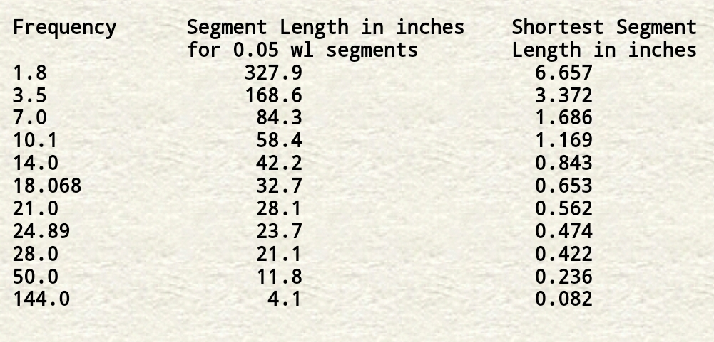
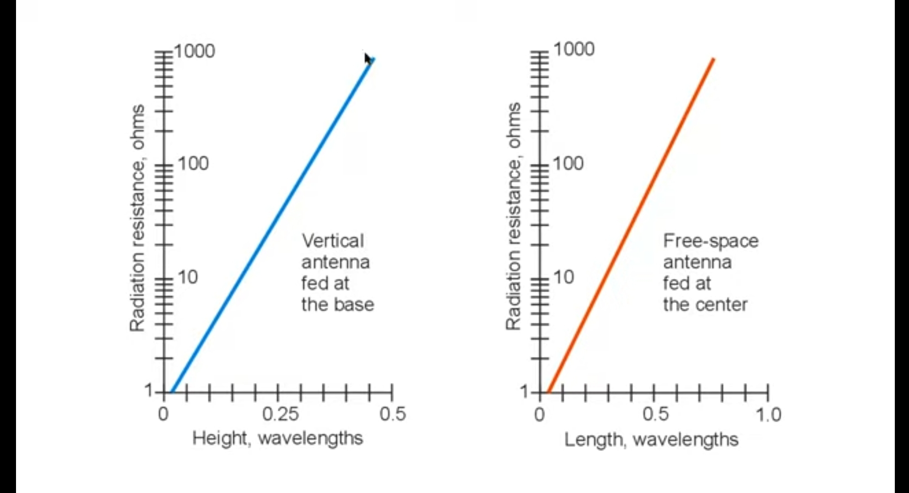

# correct_segments
Choose correct segments number for Electromagnetic waves simulation at NEC2 by checking results convergence of N simulations

Segment length should be under 0.1 wavelength long, with 0.05 wavelength preferred (about 10-11 segments per half-wavelength). Segments shorter than 0.001 wavelength should also be avoided. For reference, the following table provides a ham band list of the maximum and minimum recommended segments lengths.

Thin-wire segments are preferred: as with MININEC, the wire circumference divided by the wavelength should be much less than 1 for accurate results. Moreover, the ratio of segment length to diameter should be greater than 4 for errors less than 1%. If the model demands a smaller ratio, it should be approached cautiously by shortening segment lengths gradually with an eye toward results taking off on a tangent.

# Radiation resistance graph
Radiation resistance graph to checking simulation results especially real impedance:

# Advice
Use expert electromagnetic simulation softwares such as Altair FEKO and ANSYS Maxwell instead of NEC2 for automatic segmentation, Also for most accurate results.
