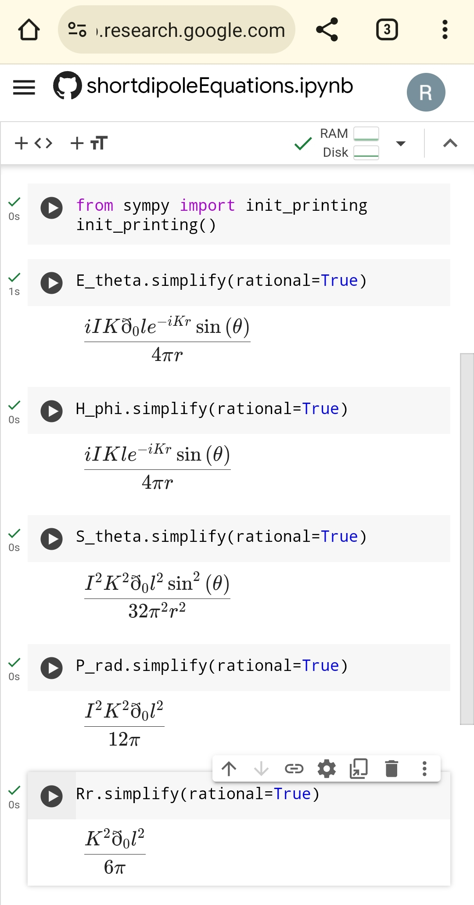

# electromagnetic
Electromagnetic formulas, simulation softwares and codes

The goal of these codes is knockout the complex physics electromagnetic equations and calculations by few lines of MATLAB and Python codes. It is head of complex physics electromagnetic equations and calculations, It goes straight to the point instead of giving foliage for solving the problem immediately.

All chapter equations of a physics electromagnetic book gathered together in few lines of MATLAB and Python codes here. For example deriving and calculating Poynting Vector integral from farfield radiation electricity field equation for calculating most critical antenna behaviors such as radiated power and radiation resistance in few lines of Python code:

short dipole antenna equations 

```
import sympy as sp

r, theta, phi, I, l, K, eth0 = sp.symbols('r theta phi I l K eth0', real=True)

E_theta = ((1j * K * I * l * eth0) / (4 * sp.pi * r)) * sp.sin(theta) * sp.exp(-1j * K * r)
H_phi = E_theta / eth0
S_theta = 0.5 * sp.re(E_theta * sp.conjugate(H_phi))
P_rad = sp.integrate(sp.integrate(S_theta * r**2 * sp.sin(theta), (theta, 0, sp.pi)), (phi, 0, 2*sp.pi))
Rr = 2 * P_rad / I**2

Power = P_rad.subs([(eth0, 377), (I, 2), (l, 0.1), (K, 2*sp.pi/6)]).evalf()  # Watts
Radiation_resistance = Rr.subs([(eth0, 377), (l, 0.1), (K, 2*sp.pi/6)]).evalf()  # Ohms

print(Power)
print(Radiation_resistance)
```

In addition to printing short dipole antenna equations in the prettiest way use this code as below by continue of above code, Also mentioned in `shortdipoleEquations.ipynb` code completely:

```
from sympy import init_printing
init_printing()
```



Also here is various numerical method codes in different languages (MATLAB, Python, C++, JavaScript, HTML), The `shortdipoleNumerical.js` code can be used at `Math Notepad` which powered by `mathjs.org`, I mean that it need `mathjs` library to running, Just with a web browser without any software installation. Guidance: 

https://github.com/rezamarzban/mathjs/tree/main/mathnotepad

The `shortdipoleNumerical.html` code is FINAL GOAL of these codes that knockout complex Electromagnetic Physics equations, Also knockout Physics and Mathematical softwares, Just run it by downloading and opening it with web browser without any used library even without internet connection at any OS. And you can edit `shortdipoleNumerical.html` with `Notepad` simply. So:

IDE: `Notepad`

Compiler: `Web browser`

The most simple things in the world of IT and programing languages solve most complex things in the world of Math and Physics, So the Math and Physics is in your hand ... .
