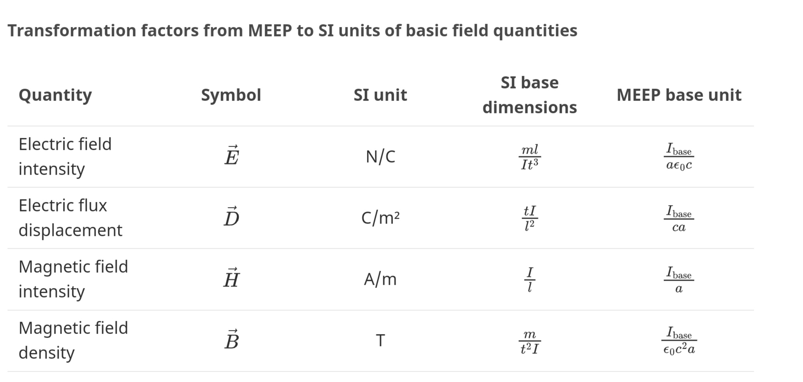
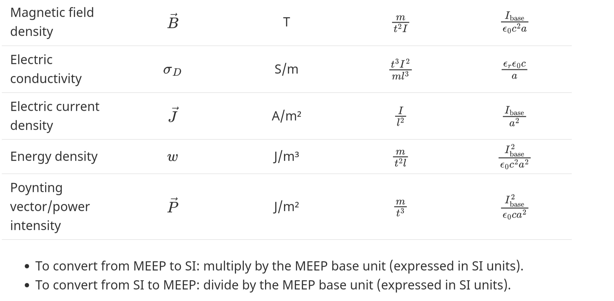

Only, MEEP units needs an university training course to learning!

MEEP frequency = a/lambda

MEEP T = 1/MEEP_frequency

`Experimental formula:`
SI power = (MEEP power @ T) * (resolution⁴) * (epsilon0*c) / lambda² 

For fluent FDTD simulation use expert softwares such as Altair FEKO, Ansys Maxwell, Comsol, CST Studio suite and etc.
