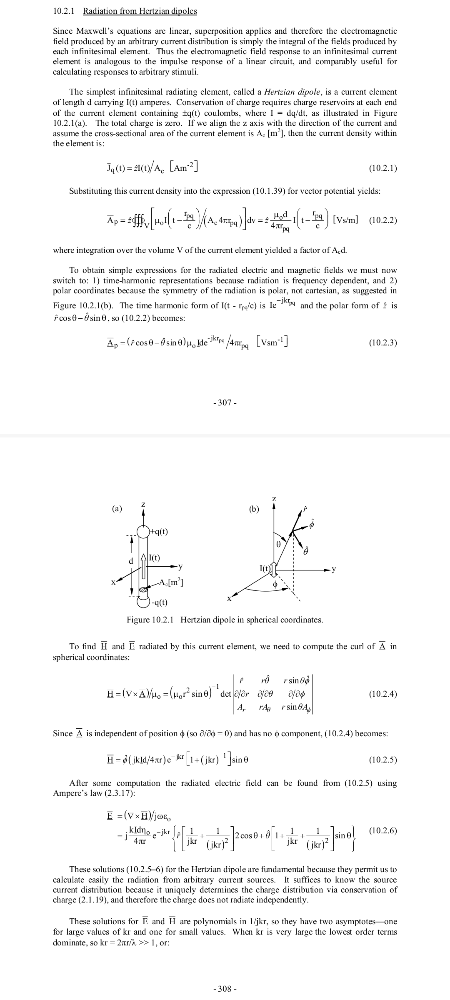
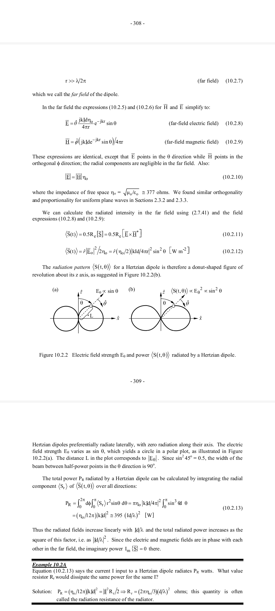
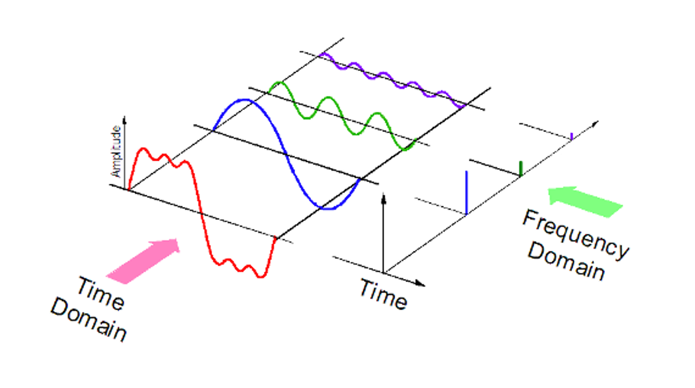

The equation:

$$
E_\theta = \left(\frac{j K I d \eta_0}{4 \pi r}\right) \sin(\theta) e^{-j K r}
$$

is derived for Hertzian dipoles antenna radiation for sinusoidal signal waveform. Another waveforms such as , square, triangular, exponentially decaying and complex waveforms in nature are not included.

Electromagnetic waves at a specific frequency are always sinusoidal in form, reflecting a fundamental characteristic of pure frequency components according to Maxwell's equations in free space. Consequently, when performing a Fast Fourier Transform (FFT) on a complex wave, such as the signal from an antenna, the result will reveal its frequency components as sinusoidal waves. **The antenna naturally decomposes the complex wave into its sinusoidal wave components, similar to the FFT function**, by capturing the various frequencies present in the signal.

**Magnetic Vector Potential**

The equation **A<sub>p</sub>** is represented as:

$$
A_p = \hat{z} \oint\oint\oint_V \frac{\mu_0 I\left(t - \frac{r_{pq}}{c}\right)}{A_c 4 \pi r} \ dv
$$

The time-harmonic form of **I(t - r<sub>pq</sub>/c)** for sinusoidal waveform:

$$
I\left(t - \frac{r_{pq}}{c}\right) = I e^{-jkr_{pq}}
$$

where **I** = **I(t)** and it is **I<sub>0</sub> sin(ωt)**. In case if **I(t)** = **I<sub>0</sub> cos(ωt)** then **I(t - r<sub>pq</sub>/c)** = **I<sub>0</sub> cos(ω(t - r<sub>pq</sub>/c))**, And its time harmonic form is **I<sub>0</sub> e<sup>j(ωt - kr<sub>pq</sub>)</sup>** = **I<sub>0</sub> e<sup>jωt</sup> e<sup>-jkr<sub>pq</sub></sup>** = **I e<sup>-jkr<sub>pq</sub></sup>**.

As shown in the images below, in the derivation of the equations for Hertzian dipoles radiation, the current source is introduced as I(t) in the equation 10.2.1 and it is transformed to time harmonic form for sinusoidal current source as **I e<sup>-jkr<sub>pq</sub></sup>** in the equation 10.2.3:




continue:



FFT provide sinewave components of a complex wave, Next, Transforming each **I(t - r<sub>pq</sub>/c)** function for sinusoidal waveform in the equation 10.2.2 to time harmonic form, provide an approach to calculating hertzian dipole antenna behaviors for complex waves.


To calculating radiated power for single frequency sinusoidal current source, the equation 10.2.13 can be used. More accurate (Not average), to calculating radiated power from poynting vector during one second is: **S<sub>total</sub> = ∫<sub>0</sub><sup>1</sup> S(t) dt** = **∫<sub>0</sub><sup>1</sup> E(t) × conj(H(t)) dt**.


**Electromagnetic simulation softwares**

It is absolutely recommended to use electromagnetic simulation softwares to calculating behaviors of antennas while waveform is not sinusoidal.


**CST Studio Suite** can define any custom waveform by means of `excitation signals`.


**Altair FEKO** can't define custom waveforms.


**ANSYS Maxwell** can't define custom waveforms for electromagnetic simulations.


**COMSOL Multiphysics** can define any custom waveform with choosing `circuit` from `terminal type` in `lumped port` and setting up `circuit interface`.


## Numerical method for real waves 

The magnetic vector potential **A** in terms of spherical coordinates can be expressed as:

$$
\mathbf{A} = \mathbf{\hat{z}} \frac{\mu_0 d}{4\pi r_{pq}} I\left(t - \frac{r_{pq}}{c}\right)
$$

where:
- **ẑ** is the unit vector in the **z**-direction.
- **μ<sub>0</sub>** is the permeability of free space.
- **d** is a characteristic dimension (e.g., length of a dipole).
- **r<sub>pq</sub>** is the distance from the source to the observation point.
- **I(t - r<sub>pq</sub>/c)** is the current shifted by the time it takes for the signal to travel the distance **r<sub>pq</sub>** at the speed of light.

In Cartesian coordinates **(x, y, z)**, the magnetic vector potential **A** is given by:

$$
r_{pq} = \sqrt{(x - x_0)^2 + (y - y_0)^2 + (z - z_0)^2}
$$

$$
\mathbf{A}(x, y, z, t) = \frac{\mu_0 d}{4\pi r_{pq}} I\left(t - \frac{r_{pq}}{c}\right) \hat{\mathbf{r}}
$$

where hat **r** is the unit vector in the direction from the source at **(x<sub>0</sub>, y<sub>0</sub>, z<sub>0</sub>)** to the observation point **(x, y, z)**, and is given by:

$$
\hat{\mathbf{r}} = \frac{(x - x_0, y - y_0, z - z_0)}{r_{pq}}
$$

The components of **A** in Cartesian coordinates are:

$$
A_x = \frac{\mu_0 d}{4\pi r_{pq}} \frac{(x - x_0)}{r_{pq}} I\left(t - \frac{r_{pq}}{c}\right)
$$

$$
A_y = \frac{\mu_0 d}{4\pi r_{pq}} \frac{(y - y_0)}{r_{pq}} I\left(t - \frac{r_{pq}}{c}\right)
$$

$$
A_z = \frac{\mu_0 d}{4\pi r_{pq}} \frac{(z - z_0)}{r_{pq}} I\left(t - \frac{r_{pq}}{c}\right)
$$


According to equation 10.2.4 ( **H = (∇ × A) / μ<sub>0</sub>** ) and by continue of `Axyz_numerical.m` MATLAB code, The farfield radiation magnetic field can be calculated as:

```
Ax = A(:,:,:,1); % A in x direction for every x,y,z
Ay = A(:,:,:,2); % A in y direction for every x,y,z
Az = A(:,:,:,3); % A in z direction for every x,y,z

[Hx, Hy, Hz] = curl(x,y,z,Ax, Ay, Az); % H = curl(A)/mu0

Hx = Hx / mu0; % H in x direction for every x,y,z
Hy = Hy / mu0; % H in y direction for every x,y,z
Hz = Hz / mu0; % H in z direction for every x,y,z
```

But, the equation 10.2.6 to calculating farfield radiation electricity field, is for time harmonic field calculations, Not for time varying field calculations.

### FFT and Time-Harmonic Analysis Workflow for real waves

The workflow of applying the Fast Fourier Transform (FFT) followed by time-harmonic analysis to analyze complex signals in the frequency domain.



1. **FFT Decomposition**:
   - **Objective**: Decompose a complex time-domain signal into its constituent sinusoidal components.
   - **Method**: Use MATLAB's `fft()` function to convert the time-domain signal into a frequency-domain representation.
   - **Output**: A frequency spectrum identifying the amplitude and phase of each sine wave component.

2. **Sinusoidal Components**:
   - **Interpretation**: The FFT result represents the original complex signal as a sum of sine waves at various frequencies.
   - **Components**: Identify the key frequencies, amplitudes, and phases from the FFT output.

3. **Time-Harmonic Analysis**:
   - **Objective**: Analyze the system’s steady-state response to each individual sinusoidal component.
   - **Application**: Perform time-harmonic analysis at each frequency identified by the FFT to understand the system's behavior under sinusoidal excitation.
   - **Outcome**: Determine the steady-state response of the system (e.g., electromagnetic fields, structural vibrations) to each sine wave.

**Applications**

- **Electromagnetic Analysis**: Study the response of antennas, circuits, or materials to multiple frequency components.
- **Vibration Analysis**: Analyze how mechanical structures respond to harmonic excitations.
- **Acoustics**: Understand how environments or materials interact with different sound frequencies.

**Example**

1. **Input**: A complex time-domain signal.
2. **Step 1**: Apply FFT to decompose the signal into sine waves.
3. **Step 2**: Perform time-harmonic analysis on each sine wave to determine the system's response.


MATLAB code:

```
clc;
clear;
close all;

% Time vector
time_step = 0.001;                  % Time step (sampling interval)
t = 1:time_step:5;                  % Time vector

% Complex signal
signal = 3 .^ mod(t, 1);

% Perform FFT
n = length(signal);                    % Length of the signal
Y = fft(signal);                       % FFT of the signal

% Sampling frequency
Fs = 1 / time_step;                   % Sampling frequency

% Frequency vector
f = (0:n-1)*(Fs/n);                   % Frequency vector
f = f(1:floor(n/2));                  % Single-sided spectrum

% Only take the first half of Y (single-sided spectrum)
Y = Y(1:floor(n/2));  

% Amplitude and phase
amplitude = abs(Y) * 2 / n;           % Amplitude of each component (scaled)
phase = angle(Y);                     % Phase of each component

% Find the significant peaks in the amplitude spectrum
[pks, locs] = findpeaks(amplitude, 'MinPeakHeight', 0.05 * max(amplitude)); 

% Print the time-harmonic form I * exp(j * omega * t) for each significant component
for k = 1:length(locs)
    freq = f(locs(k));                % Frequency in Hz
    omega = 2*pi*freq;                % Angular frequency in rad/s
    I = pks(k);                       % Amplitude
    phi = phase(locs(k));             % Phase in radians
    fprintf('Component %d: I = %.3f, omega = %.3f rad/s, phase = %.3f rad\n', locs(k), I, omega, phi);
    fprintf('Time-harmonic form: %.3f * exp(j * (%.3f * t + %.3f))\n\n', I, omega, phi);
end
```


To visualize Signal, Single sided spectrum, Sinewave components by continue of before code:

```
% Plot the original signal
figure;
subplot(3,1,1);
plot(t, signal);
title('Original Signal');
xlabel('Time (s)');
ylabel('Amplitude');

% Plot the single-sided spectrum
subplot(3,1,2);
plot(f, amplitude);
title('Single-Sided Spectrum');
xlabel('Frequency (Hz)');
ylabel('Amplitude');

% Plot individual sine waves
subplot(3,1,3);
hold on;
for k = 1:length(locs)
    freq = f(locs(k));                % Frequency in Hz
    omega = 2*pi*freq;                % Angular frequency in rad/s
    I = pks(k);                       % Amplitude
    phi = phase(locs(k));             % Phase in radians
    sinewave = I * cos(omega * t + phi); % Compute the sine wave
    plot(t, sinewave);
end
title('Individual Sine Waves');
xlabel('Time (s)');
ylabel('Amplitude');
legend(arrayfun(@(x) sprintf('Freq = %.1f Hz', f(x)), locs, 'UniformOutput', false));
hold off;
```

**Power Calculation for Multiple Frequencies**

Given the power expression for a single sinewave frequency according to equation 10.2.13:

**P = 395 (I d / λ)<sup>2</sup>**

where:

- **P** is the power.
- **I** is the current.
- **d** is the length of the antenna.
- **λ** is the wavelength.

For multiple sinewave frequencies, the total power radiated by the antenna can be calculated by summing the contributions from each individual frequency.

**For n Different Frequencies**

The total power **P<sub>total</sub>** is given by:

**P<sub>total</sub> = Σ [395 (I<sub>i</sub> d / λ<sub>i</sub>)<sup>2</sup>]**  
for **i = 1** to **n**

Where:

- **I<sub>i</sub>** is the current corresponding to the **i**-th frequency.
- **λ<sub>i</sub>** is the wavelength corresponding to the **i**-th frequency, **λ<sub>i</sub> = c / f<sub>i</sub>**.

This equation accounts for the contribution of each frequency to the total radiated power.

Finally, the `complexWave*.*` codes calculate hertzian dipole antenna behaviors using FFT for complex waves.
