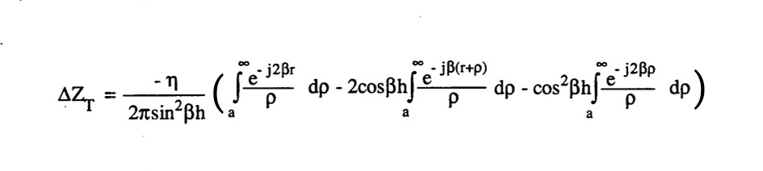
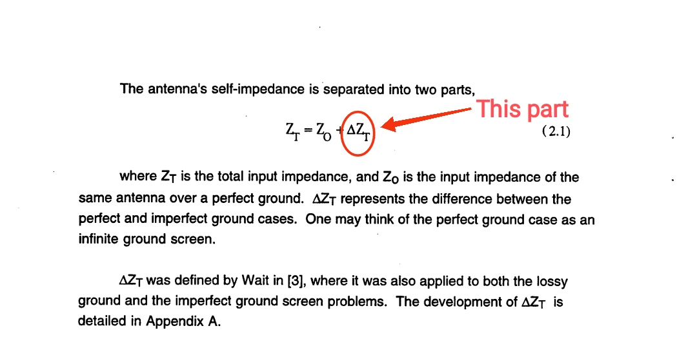

Wait's formula:


Very complex Wait's formula is derived from Norton-Sommerfeld equations, To calculating this confusing formula by `sympy` run below codes at Jupyter Notebook:

```
from sympy import *
init_printing(use_unicode=True)

r, eta, beta, rho, a, h = symbols('r eta beta rho a h', real=True)

beta = 2*pi/100
a = 18
h = 20
r = sqrt(rho**2 + h**2)

expr0 = (-eta)/((2*pi*sin(beta*h)**2))
expr1 = Integral(exp(-1j*2*beta*r)/rho, (rho, a, oo)) 
expr2 = -1*2*cos(beta*h)*Integral(exp(-beta*1j*(r + rho))/rho, (rho, a, oo)) 
expr3 = -cos(beta*h)**2*Integral(exp(-1j*2*beta*rho)/rho, (rho, a, oo))

norm = 4*pi*expr0/eta
```

Then:
```
norm_deltaZ_re = re(norm.evalf() * (expr1.evalf() + expr2.evalf() + expr3.evalf()))
```

finally:
```
norm_deltaZ_re.evalf()
```

It calculate normalized radiation resistance (=Real{4π∆Z/η}) of a sample antenna which is related only to ground wave propagation part (see below image for more info), In few lines of codes!


