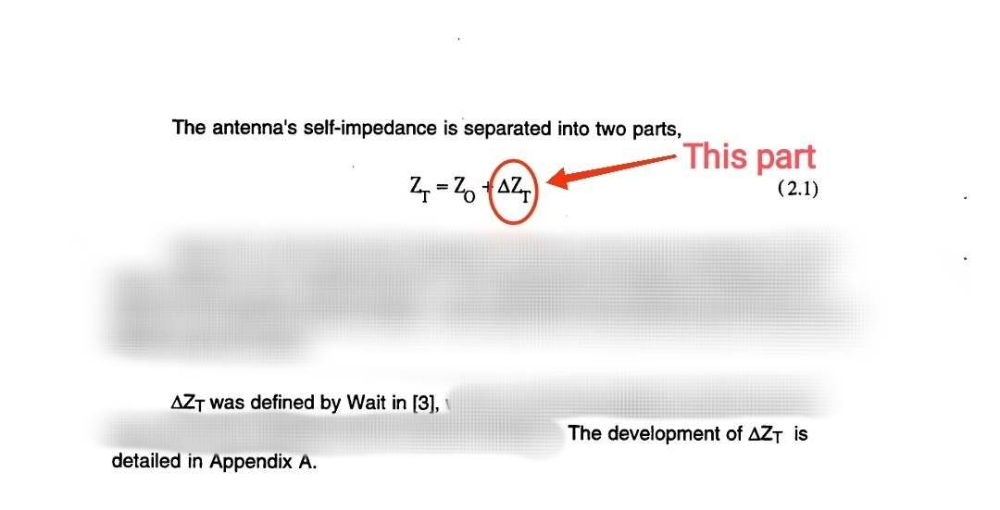

Wait's formula:


Very complex Wait's formula is derived from Norton-Sommerfeld equations, To calculating this confusing formula by `Symbolic` package at `Octave` use `Wait_formula.m` file as below. Also be noticed that `SymPy` is lacking to solve and calculating complex integrals with imaginary part! But `Symbolic` package at `Octave` which use `SymPy` is lacking less:

```
pkg load symbolic

syms r eta beta rho a h real

beta = 2*pi/100;
a = 18;
h = 20;

r = sqrt(rho^2 + h^2);

expr0 = (-eta)/((2*pi*sin(beta*h)^2));
expr1 = int(exp(-1i*2*beta*r)/rho, rho, a, inf); 
expr2 = -1*2*cos(beta*h)*int(exp(-beta*1i*(r + rho))/rho, rho, a, inf); 
expr3 = -cos(beta*h)^2*int(exp(-1i*2*beta*rho)/rho, rho, a, inf);

norm = 4*pi*expr0/eta;

norm_deltaZ_re = real(double(norm) * (double(expr1) + double(expr2) + double(expr3)))
```

It calculate normalized radiation resistance (=Real{4π∆Z/η}) of a sample antenna which is related only to ground wave propagation part (see below image for more info), In few lines of codes!



It is recommended to use `Altair FEKO`, `ANSYS Maxwell ` and etc to calculating and simulating electromagnetic problems.


#### Calculation result in softwares:
* Wolfram alpha: NaN
* Octave: Ok
* MATLAB: NaN
* Wolfram Mathematica: NaN
* SymPy: NaN

`Ok` means code is correct and software could calculate it however it seems that result is wrong (Also C++ and JavaScript via numerical method will make same wrong result to Octave symbolic package wrong result for wait formula calculation however code is correct). `NaN` means software couldn't calculate it.

Numerical method C++ code:
```
#include <iostream>
#include <cmath>
#include <complex>

int main() {
    double beta = 2 * M_PI / 100;
    double a = 18;
    double h = 20;

    double norm_deltaZ = 0.0;
    double rho_step = 0.01;

    double integral1_real = 0.0;
    double integral1_imag = 0.0;
    double integral2_real = 0.0;
    double integral2_imag = 0.0;
    double integral3_real = 0.0;
    double integral3_imag = 0.0;

    for (double rho = a; rho < 1000; rho += rho_step) {
        double arg1 = -1 * 2 * beta * sqrt(rho * rho + h * h);
        double arg2 = -1 * beta * (sqrt(rho * rho + h * h) + rho);
        double arg3 = -1 * 2 * beta * rho;

        integral1_real += std::cos(arg1) * rho_step;
        integral1_imag += std::sin(arg1) * rho_step;
        integral2_real += std::cos(arg2) * rho_step;
        integral2_imag += std::sin(arg2) * rho_step;
        integral3_real += std::cos(arg3) * rho_step;
        integral3_imag += std::sin(arg3) * rho_step;
    }

    double trapz1_real = integral1_real - 1 * 2 * std::cos(beta * h) * integral2_real - std::cos(beta * h) * std::cos(beta * h) * integral3_real;
    double trapz1_imag = integral1_imag - 1 * 2 * std::cos(beta * h) * integral2_imag - std::cos(beta * h) * std::cos(beta * h) * integral3_imag;

    norm_deltaZ_re = (-2 / (std::sin(beta * h) * std::sin(beta * h))) * trapz1_real;

    std::cout << norm_deltaZ_re << std::endl;

    return 0;
}
```

Numerical method JavaScript code:
```
const MathPI = Math.PI;

const beta = 2 * MathPI / 100;
const a = 18;
const h = 20;

let norm_deltaZ = 0.0;
const rho_step = 0.01;

let integral1_real = 0.0;
let integral1_imag = 0.0;
let integral2_real = 0.0;
let integral2_imag = 0.0;
let integral3_real = 0.0;
let integral3_imag = 0.0;

for (let rho = a; rho < 1000; rho += rho_step) {
    const arg1 = -1 * 2 * beta * Math.sqrt(rho * rho + h * h);
    const arg2 = -1 * beta * (Math.sqrt(rho * rho + h * h) + rho);
    const arg3 = -1 * 2 * beta * rho;

    integral1_real += Math.cos(arg1) * rho_step;
    integral1_imag += Math.sin(arg1) * rho_step;
    integral2_real += Math.cos(arg2) * rho_step;
    integral2_imag += Math.sin(arg2) * rho_step;
    integral3_real += Math.cos(arg3) * rho_step;
    integral3_imag += Math.sin(arg3) * rho_step;
}

const trapz1_real = integral1_real - 1 * 2 * Math.cos(beta * h) * integral2_real - Math.cos(beta * h) * Math.cos(beta * h) * integral3_real;
const trapz1_imag = integral1_imag - 1 * 2 * Math.cos(beta * h) * integral2_imag - Math.cos(beta * h) * Math.cos(beta * h) * integral3_imag;

norm_deltaZ_re = (-2 / (Math.sin(beta * h) * Math.sin(beta * h))) * trapz1_real;

console.log(norm_deltaZ_re);
```

#### Numerical method:

trapz() computes the approximate integral via the trapezoidal method with unit spacing, In this case any integral calculation will be simple and easy for many softwares, At MATLAB , Octave, Python and FORTRAN, The calculation result via numerical method will be correct. But C++ and JavaScript calculation result via numerical method will be wrong exactly same as Octave symbolic package calculation result however code is correct. See `numerical` folder.

#### Calculation result via numerical method at softwares:

* MATLAB: True
* Octave: True
* Python: True
* FORTRAN: True
* C++: False
* JavaScript: False

`True` means result is correct, `False` means result is wrong however code is correct.
