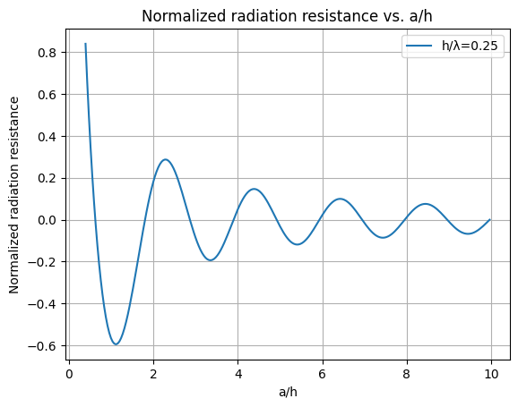

Here is much faster wait formula calculation with numerical method at `MATLAB` and `Python` instead of `symbolic` package method. At this `MATLAB` and `Python`, The `trapz()` function is used for numerical method integral calculation. Also, Here is accelerated numerical method integral calculation with `numba` module at `wait_formula_numba.py` code, Which can be used for plotting normalized radiation resistance vs `a/h` because of its high speed computation like as this below code:

```
import matplotlib.pyplot as plt
from numba import jit
from numpy import *

@jit(nopython=True)
def compute_norm_deltaZ(a, h, beta):
    rho = arange(a, 1000, 0.02)

    trapz1 = trapz(exp(-1j * 2 * beta * sqrt(rho ** 2 + h ** 2)) / rho, rho)
    trapz2 = trapz(exp(-beta * 1j * (sqrt(rho ** 2 + h ** 2) + rho)) / rho, rho)
    trapz3 = trapz(exp(-1j * 2 * beta * rho) / rho, rho)

    norm_deltaZ = (-2 / (sin(beta * h) ** 2)) * (trapz1 - 1 * 2 * cos(beta * h) * trapz2 - cos(beta * h) ** 2 * trapz3)

    return real(norm_deltaZ)

beta = 2 * pi / 100
h = 25
a_values = arange(10, 250)
norm_deltaZ_values = zeros_like(a_values, dtype=float64)

for i, a in enumerate(a_values):
    norm_deltaZ_values[i] = compute_norm_deltaZ(a, h, beta)

plt.plot(a_values/h, norm_deltaZ_values, label="h/λ=0.25")
plt.xlabel('a/h')
plt.ylabel('Normalized radiation resistance')
plt.title('Normalized radiation resistance vs. a/h')
plt.grid(True)
plt.legend()
plt.show()
```

Or with CUDA:

```
import cupy as cp
import matplotlib.pyplot as plt
from numpy import pi, arange, exp, sin, cos, sqrt, zeros_like

def compute_norm_deltaZ(a, h, beta):
    rho = cp.arange(a, 1000, 0.02)
    rho_gpu = cp.asarray(rho)  # Convert to CuPy array

    # Compute the integrals using CuPy
    exp_term1 = cp.exp(-1j * 2 * beta * cp.sqrt(rho_gpu ** 2 + h ** 2)) / rho_gpu
    trapz1 = cp.trapz(exp_term1, rho_gpu)

    exp_term2 = cp.exp(-beta * 1j * (cp.sqrt(rho_gpu ** 2 + h ** 2) + rho_gpu)) / rho_gpu
    trapz2 = cp.trapz(exp_term2, rho_gpu)

    exp_term3 = cp.exp(-1j * 2 * beta * rho_gpu) / rho_gpu
    trapz3 = cp.trapz(exp_term3, rho_gpu)

    norm_deltaZ = (-2 / (cp.sin(beta * h) ** 2)) * (trapz1 - 2 * cp.cos(beta * h) * trapz2 - cp.cos(beta * h) ** 2 * trapz3)

    return cp.asnumpy(cp.real(norm_deltaZ))  # Convert result back to numpy array

beta = 2 * pi / 100
h = 25
a_values = arange(10, 250)
norm_deltaZ_values = zeros_like(a_values, dtype=float64)

for i, a in enumerate(a_values):
    norm_deltaZ_values[i] = compute_norm_deltaZ(a, h, beta)

plt.plot(a_values / h, norm_deltaZ_values, label="h/λ=0.25")
plt.xlabel('a/h')
plt.ylabel('Normalized radiation resistance')
plt.title('Normalized radiation resistance vs. a/h')
plt.grid(True)
plt.legend()
plt.show()
```



Please be noticed that infinity at numerical method is defined by a large number value in code such as:`1000`, `10000`, `100000`, ... .

The calculation speed of `numpy` is more than calculation speed of `sympy` for Wait formula integrals, And calculation speed of `numba` is more than calculation speed of `numpy` for Wait formula integrals, So:

* Mathematical method calculation speed with `sympy`: Slow
* Numerical method calculation speed with `numpy`: Fast
* Accelerated numerical method calculation speed with `numba`: Very fast

The `sympy` calculate one case of Wait formula in less than a minute, While `numba` calculate thousand cases of Wait formula in less than a minute. So with `numba` it is easy to ploting results vs variable.

Also here is `FORTRAN` code that is very fast.
